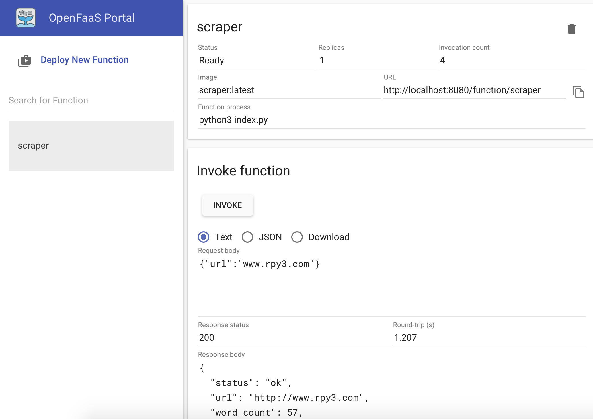

# openfaas_scraper
Example of function for openfaas. This function scrape the website and return the text and word counts.



## Download openfaas and make new function templates

```sh

echo "set variables "
IP = "1XX.XX.XXX.XX"

echo "Get openfaas from github"
git clone https://github.com/openfaas/faas

echo "start the swarm"
docker swarm init --advertise-addr $IP

echo "deploy openfass"
cd faas
./deploy_stack.sh --no-auth

echo "get openfaas cli"
curl -sSL https://cli.openfaas.com | sudo sh

echo "Make new folder"
mkdir -p ~/functions && \
  cd ~/functions
  
echo "make new funcation templates"
faas-cli new --lang python scraper


echo "if auth id one login"
# faas-cli login -u admin -p xxxxxxxxxxxx
```

## Update the handler.py with your desired code and than deploy function

```sh

faas-cli build -f ./scraper.yml && \
  faas-cli deploy -f ./scraper.yml

````

# Endpoints

Endpoint: */function/scraper*  

TYPE: GET

INPUT: TEXT
``` sh
'{
 "url": "https://blog.alexellis.io/rss/",
 "threshold": 2
}'

```

OUTPUT

```json
{
  "status": "ok",
  "url": "http://www.rpy3.com",
  "word_count": 57,
  "text_counts": {
    "api": 2
  },
  "text": "rpy3\ntoggle navigation\nrpy3\nhome\nabout\nrpy3\nfun begins\neach project 
  has api and web interface.\ntext api\nfind part-of-speech tagging, 
  noun phrase extraction, sentiment analysis, classification, translation, 
  and more of any sentence. you can also use api at /v1/api/text with 
  payload \"data\".\nslove sudoku\nsolve any normal sudoku. replace empty space by 
  .(dot) and move from left to right. enter all 81 digits and your good to go. 
  e.g for above image its 2.............62....1....7...6..8...3...9...7...6..4..
  .4....8....52.............3\npdf miner\nextract the text from pdf doc with 
  metadata like location, fonts and textbox size.\nprivacy policy | c
  ontact\ncopyright © 2017",
  "time": 0.5065762996673584
}
```

EXAMPLE
```sh
curl localhost:8080/function/scraper -d '{
 "url": "https://blog.alexellis.io/rss/",
 "threshold": 2
}'
```

